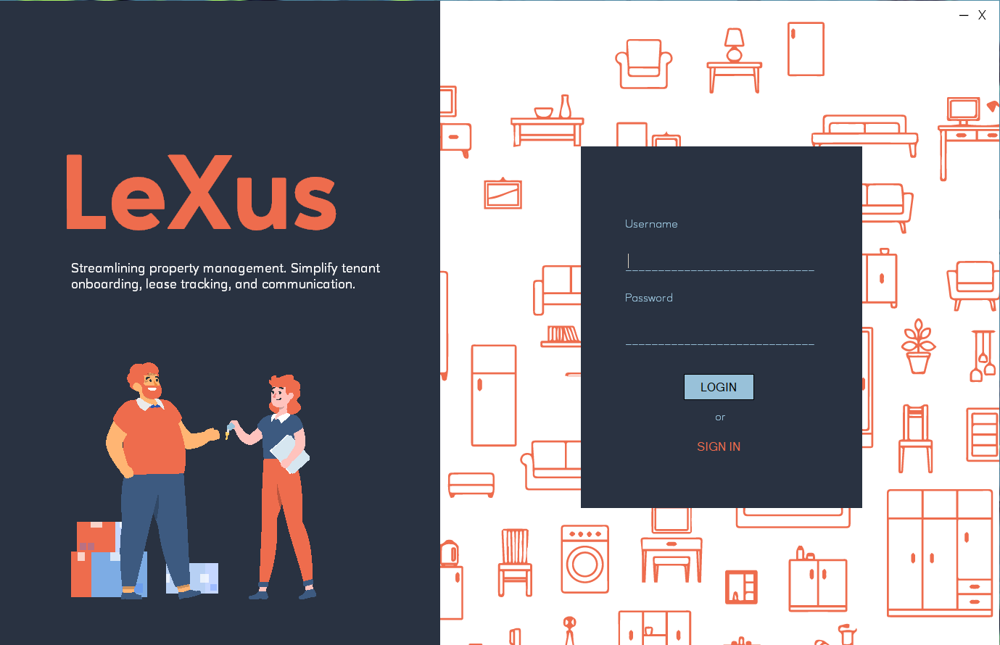

# LeXus

LeXus is a comprehensive platform designed to streamline property management. It simplifies tenant onboarding, lease tracking, and communication, providing property managers with an efficient and user-friendly tool to manage operations and improve tenant experience.

## Features

- **Tenant Onboarding**: Simplifies the process of adding and managing tenants.
- **Lease Tracking**: Efficiently tracks lease agreements and payment schedules.
- **Communication**: Enhances communication between property managers and tenants.

## Technologies

- **C#**
- **T-SQL**

## Installation

Clone the repository:

```bash
git clone https://github.com/joxyle-jhon/LeXus.git

# Sample UI ngeks


